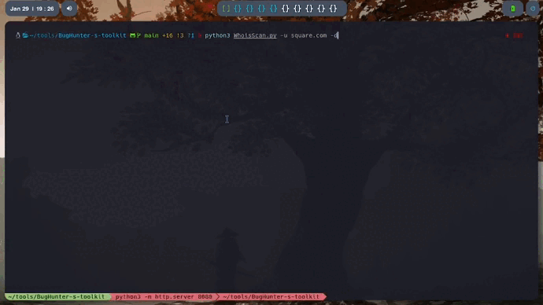
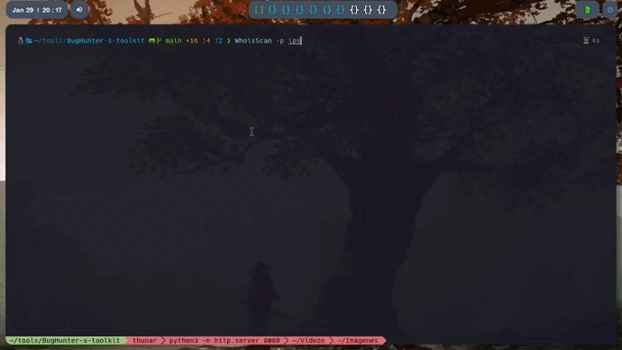

# BugHunter Toolkit

This is a compilation of the automatic scanners that I have made for my work as a BugHunter at Bugcrowd and Intigriti (but I'm looking to change to HackerOne).

In this case the WhoisScan is a scanner with four main functions to know the essentials of your target.

## Index

* [Functions](#Functions)
* [Subdomain Recognition](#Subdomain-recognition)
* [IP leakeage](#IP-leakeage)
* [ISP](#ISP)
* [PORT scanner](#PORT-scanner)
* [Instalation](#Instalation)

## Functions
### Subdomain recognition

The first function is a complete scan to find subdomains without any API. 
I was able to code one of the techniques that I was using, it can find even more subdomains that doing that manually.

It's simple:
1. Scan the cert of the subdomain to find coincidences
2. Split the coincidences to generate a wordlist
3. Then, use to wordlist to generate a list of posibles subdomains (the second list in the scan)
4. Now generate a third wordlists using the first wordlist and the second one.
5. And finaly, check for valid subdomains.

In this way I was able to get more subdomains than using other tools (like subl3ster or subfinder), but this technique takes longer than using one of that tools.

But I'm fixing that :D

### IP leakeage

The second function allow to proof a basic way to find IP leakeage in a server. Most of the time, the company just think in their principal domains, and they left the other domains (the domains used commonly for services like SAML or mailing) without any proxy, which allow a IP leakeage.

This tool also use a scan to check for more devices in the network (you have to especify the target), and in a few second it will retrieve all the devices related to that IP.

### ISP

This is a scanner to verify every IP obtained in the IP leakeage function. In the future the idea is use a API to get the ISP, but I wasn't able to make it work yet.

One of the APIs I'm thinking to use is the one from https://ipinfo.io, but it have a limit, and it's to low at least for me, so, maybe I will find another way to get the ISP of the target.

### PORT scanner

This is a simple scanner to get the most common open ports on the targets I have seen. The idea is to look at each IP without being too noisy and leave less logging on the target.
With NMAP you can get the IP blocked by mistake, but with this scanner it is unlikely.

## Instalation

It's quite easy to install this tool. Just give a start to the proyect (it help :D), then clone the repo and execute install.py in your computer. It will install everything for you.
